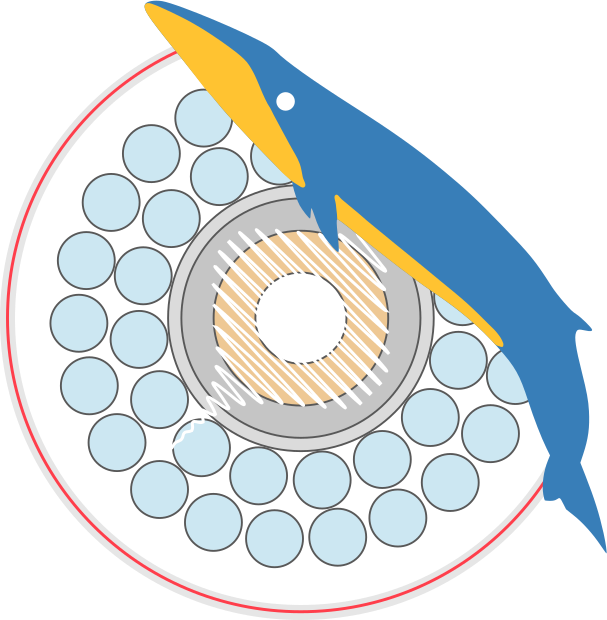

<div align="center">
  
  <h1>DAS4Whales</h1>
</div>

[](https://zenodo.org/badge/latestdoi/604782489)
[](https://colab.research.google.com/gist/leabouffaut/e66b5a741493c4bd13aa07f39586ec4b/das4whales_examplenotebook.ipynb)
[](https://creativecommons.org/licenses/by-nc-sa/4.0/)

[](https://github.com/DAS4Whales/DAS4Whales/actions/workflows/ci.yml)
[](https://das4whales.readthedocs.io/en/latest/?badge=latest)

### Documentation 
The full documentation of the DAS4Whales package is available at [das4whales.readthedocs.io](https://das4whales.readthedocs.io/en/latest/)

<!-- SPHINX-START -->
## About DAS4Whales 
Python package to analyze Distributed Acoustic Sensing (DAS) data for marine bioacoustics

Authors: 
- Léa Bouffaut, Ph.D.   
K. Lisa Yang Center for Conservation Bioacoustics, Cornell Lab of Ornithology, Cornell University. Ithaca (NY), USA

[Contact](mailto:lb736@cornell.edu) | [Webpage](https://www.birds.cornell.edu/ccb/lea-bouffaut/) | [Twitter](https://twitter.com/LeaBouffaut)


- Quentin Goestchel, Ph.D.  
William Wilcock Lab - Ocean Data Lab, School of Oceanography, University of Washington. Seattle (WA), USA

[Contact](mailto:qgoestch@uw.edu) | [Webpage](https://qgoestch.github.io/qgoestch/) 


```{note}
Please cite this package as:   
Léa Bouffaut (2023). DAS4Whales: A Python package to analyze Distributed Acoustic Sensing (DAS) data for marine bioacoustics (v0.1.0). Zenodo. https://doi.org/10.5281/zenodo.7760187
```

## Background
Distributed acoustic sensing or DAS, offers exciting new opportunities to eavesdrop on whales by converting existing fiber optic cables into dense listening arrays of strain sensors. It exploits the physics of Raleigh backscattering following the introduction of an interrogating pulse in the fiber, converting time-delays (or phase changes) of the backscattered pulses into strain measurements, analogous to acoustic pressure. DAS is also known as Distributed Fiber Optic Sensing (DFOS), coherent backscattering, Phase Optical Time Domain Reflectometry ($\Phi$-OTDR).

For a complete DAS technical overview see:
>Hartog, A. H. (2017). An Introduction to Distributed Optical Fibre Sensors (1st ed.). CRC Press. https://doi.org/10.1201/9781315119014

For the specific application of DAS for whale bioacoustics (we will use the same terminology) see:

>Bouffaut, L., Taweesintananon, K., Kriesell, H. J., Rørstadbotnen, R. A., Potter, J. R., Landrø, M., Johansen, S. E., Brenne, J. K., Haukanes, A., Schjelderup, O., & Storvik, F. (2022). Eavesdropping at the Speed of Light: Distributed Acoustic Sensing of Baleen Whales in the Arctic. Frontiers in Marine Science, 9, 901348. [https://doi.org/10.3389/fmars.2022.901348](https://doi.org/10.3389/fmars.2022.901348)

## How-to use the das4whales package 
[This Jupyter notebook](https://github.com/leabouffaut/DAS4Whales/blob/main/DAS4Whales_ExampleNotebook.ipynb) available in [Colab](https://colab.research.google.com/gist/leabouffaut/e66b5a741493c4bd13aa07f39586ec4b/das4whales_examplenotebook.ipynb)  provides an illustration of the current functionalities of the DAS4Whales python package, available on [this GitHub repository](https://github.com/leabouffaut/DAS4Whales). For now, the package enables basic manipulations and visualizations of DAS data such as:

* reading the metadata and loading DAS strain data from a hdf5 file -- functionalities available in the module `das4whales.data_handle`,
* high-pass, band-pass and frequency-wavenumber (f-k) filtering -- functionalities available in the module `das4whales.dsp`,
* spatio-temporal (t-x plot), spatio-spectral (f-x plot) and single channel spectro-temporal (spectrogram) representations -- functionalities available in the module `das4whales.plot`,
* single channel sound playbacks -- functionality available in this notebook

All functions have built-in documentation accessible through the pythonic `help(das4whales.module.function)` and on the [DAS4Whales documentation](https://das4whales.readthedocs.io/en/latest/).

## DAS data
If you don't have DAS data, we've got you covered! This notebook is set to automatically download a file from the RAPID: Distributed Acoustic Sensing on the OOI’s Regional Cabled Array experiment in Oregon, which is available in open access. The data we'll look at was recorded using an OptaSense interrogator and is saved in the hdf5 format. To learn more about this experiment see:

>Wilcock, W., & Ocean Observatories Initiative. (2023). Rapid: A Community Test of Distributed Acoustic Sensing on the Ocean Observatories Initiative Regional Cabled Array [Data set]. Ocean Observatories Initiative. https://doi.org/10.58046/5J60-FJ89

## A final word
Please, report any bugs or issues you may have using this package and notebook either through GitHub Issues or directly by email. This is our first Python package, and we are always keen on learning how to make our work more inclusive, accessible and modular. **New contributors are Welcome!**

