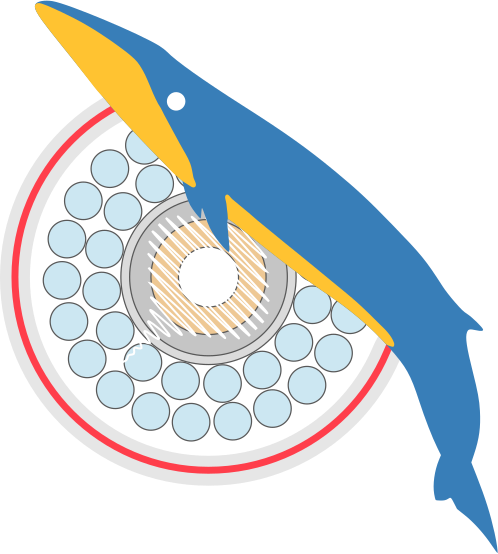

<div align="center">
  
  <h1>DAS4Whales</h1>
</div>

[](https://github.com/DAS4Whales/DAS4Whales)
```{toctree}
:maxdepth: 1
:caption: Getting Started

/src/install
/src/tutorial

```

```{toctree}
```

```{toctree}
:maxdepth: 3
:caption: Modules documentation
:hidden:

api/das4whales

/src/data_handle
/src/dsp
/src/detect
/src/plot
/src/graph
```

```{include} ../README.md
:start-after: <!-- SPHINX-START -->
```

## Indices and tables

- {ref}`genindex`
- {ref}`modindex`
- {ref}`search`


## External Links

- `GitHub Repository:`[https://github.com/qgoestch/DAS4Whales](https://github.com/qgoestch/DAS4Whales)